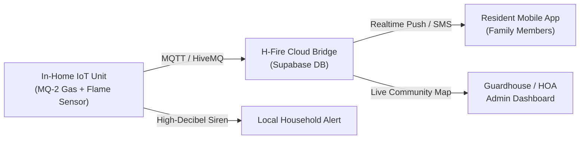
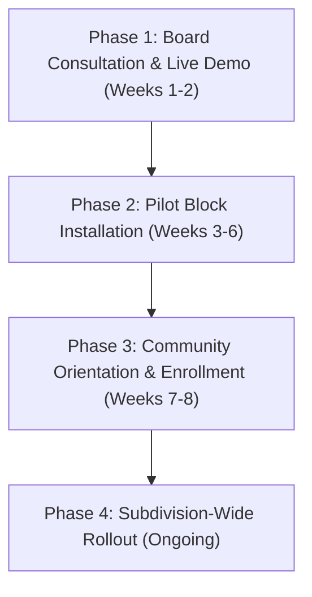

# PROJECT PROPOSAL: H-FIRE COMMUNITY SAFETY SYSTEM
**Integrated Fire & Gas Leak Early Warning and Monitoring Platform**

---

**Prepared For:** The Board of Directors, Officers, and Homeowners  
**Community:** BellaVita Subdivision  
**Date:** October 2026  
**Document Version:** 1.1  
**Prepared By:** H-Fire Project Development Team  

---

## 1. Executive Summary

Residential safety, rapid emergency communication, and disaster prevention are foundational to a thriving and secure subdivision. Within dense residential developments such as **BellaVita**, homes are typically configured in clustered rowhouse and townhouse layouts sharing common structural firewalls. Under these conditions, an undetected Liquefied Petroleum Gas (LPG) leak or an unattended cooking flame in one home can quickly escalate into a multi-unit hazard.

**H-Fire** is an integrated IoT (Internet-of-Things) early warning and community monitoring platform. By combining compact, in-home sensor hardware with a resident-facing smartphone app and a centralized guardhouse/HOA monitoring dashboard, H-Fire detects hazards at their earliest stages, sounds immediate local alarms, notifies residents wherever they are, and equips subdivision security to respond within minutes.

---

## 2. Community Assessment & Hazard Analysis

| Community Characteristic | Fire & Gas Safety Concern | H-Fire Mitigation |
| :--- | :--- | :--- |
| **Rowhouse Architecture & Shared Walls** | Heat, smoke, and flames can spread across shared roof trusses and attic spaces. | Immediate detection at the source unit before smoke breaches neighboring walls. |
| **Occupants Away at Work or School** | Gas leaks from faulty stove hoses or regulator valves often go unnoticed until someone returns and flips an electric switch. | 24/7 cloud monitoring with instant push notifications and alerts sent to homeowners' phones. |
| **Power Outages & Brownouts** | During electrical blackouts or typhoons, residents often resort to candles, emergency lights, or alternative cooking, drastically raising fire risks when normal power is dead. | **Optional Power Bank Backup:** The unit runs on standard 5V USB, allowing homeowners to manually plug in a power bank so monitoring stays active during blackouts. |
| **Communication Delay with Security / BFP** | Standard protocols rely on shouts or phone calls after flames are already visible outside, delaying fire containment. | Subdivision security dashboard instantly maps the exact Block and Lot undergoing an emergency. |

---

## 3. The H-Fire Solution Architecture

The system operates across three interconnected layers:

### A. In-Home Smart Detection Hardware
- **Dual-Hazard Detection:** Houses an **MQ-2 Gas/Smoke Sensor** (calibrated for LPG, butane, and combustible smoke) and an optical **Infrared Flame Sensor**.
- **On-Device LCD & Audible Siren:** Provides immediate visual gas PPM readouts and sounds a high-decibel local buzzer to awaken sleeping household members.
- **Low Power Consumption:** Operates on standard 5V micro-USB power (compatible with standard phone chargers).
- **Optional Power Bank Backup (Outage Protection):** Homeowners who wish to maintain continuous protection during brownouts or grid interruptions can manually connect any standard USB power bank. This keeps the sensors and local siren fully operational even when household power is completely out.

### B. Resident Mobile Application (iOS & Android)
- **Continuous PPM Monitoring:** Allows residents to check their home's air safety status anytime from their smartphones.
- **Graduated Alert Thresholds:**
  - **Normal ($\le$ 450 PPM):** Green status; standard indoor air quality.
  - **Warning (451 – 1,500 PPM):** Yellow status; minor leak or cooking smoke buildup alert.
  - **Danger (> 1,500 PPM or Flame Detected):** Red status; full-screen emergency siren, haptic vibration, and emergency action instructions.
- **Family Emergency Network:** Automatically dispatches alerts and notifications to listed family members and emergency contacts.

### C. HOA Security & Admin Monitoring Dashboard
- **Live Community Map:** Pinpoints all connected units across the BellaVita subdivision layout, with real-time color-coded pins (Normal / Warning / Danger).
- **Incident Dispatch:** Enables security guards or barangay tanods to identify the exact block and lot within seconds to isolate gas supplies, shut off outdoor power, or aid evacuation before the Bureau of Fire Protection (BFP) arrives.

---

## 4. Key Value Propositions for BellaVita

1. **Life Safety & Structural Preservation:** Significantly reduces the likelihood of structural fire incidents across interconnected units.
2. **Resilience During Blackouts:** Homeowners have the freedom to manually plug in any personal power bank, guaranteeing active sensors and siren alarms even during seasonal power outages.
3. **24/7 Remote Vigilance:** Peace of mind for working parents, OFW families, and commuters whose homes are unattended during daytime hours.
4. **Enhanced Property Value:** Distinguishes BellaVita as a forward-thinking, tech-enabled, and safety-certified residential community.
5. **Community Collaboration:** Fosters proactive cooperation between homeowners, the HOA Board, and community security personnel.

---

## 5. Phased Implementation Roadmap

- **Phase 1: Board Consultation & Demonstration**
  - Conduct a live operational demonstration for the HOA Board of Directors showcasing gas leak triggering, mobile notification, power bank switchover, and security dispatch.
- **Phase 2: Pilot Testing**
  - Deploy units across selected test homes (or the clubhouse and security gate) for 30 days of data logging and network validation.
- **Phase 3: Homeowner Orientation**
  - Host a brief community town hall to introduce the resident mobile app, proper sensor placement (kitchen/LPG area), power bank manual backup usage, and basic fire response procedures.
- **Phase 4: Full Deployment & Support**
  - Phased home installations, admin dashboard deployment at the security guardhouse, and dedicated technical maintenance support.

---

## 6. Next Steps & Meeting Request

We invite the BellaVita Homeowners Association Board of Directors to schedule an initial **15-minute live demonstration** at your upcoming board meeting or at the community clubhouse.

During this session, we will simulate:
1. An active LPG leak triggering the hardware alarm.
2. Manual power bank operation during a simulated power outage.
3. Instant alert reception on the Resident Mobile App.
4. Live unit mapping on the HOA Security Dashboard.

---

### Contact Information

For inquiries, scheduling, or technical specifications, please contact:

**H-Fire Development Team**  
**Lead Representative:** [Your Name / Team Lead]  
**Position:** [Your Role / Project Lead]  
**Mobile:** [Insert Contact Number]  
**Email:** [Insert Email Address]  
**Website / Repository:** [Insert Link / Portfolio]  
