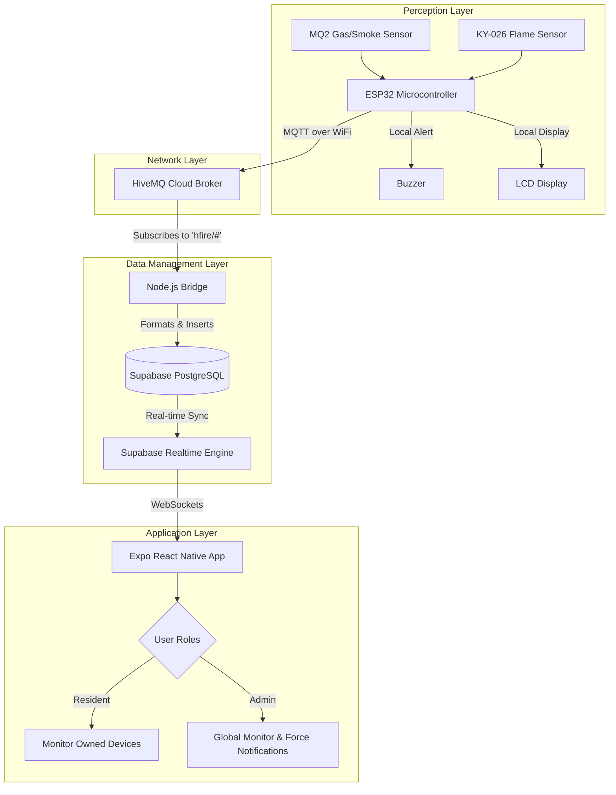
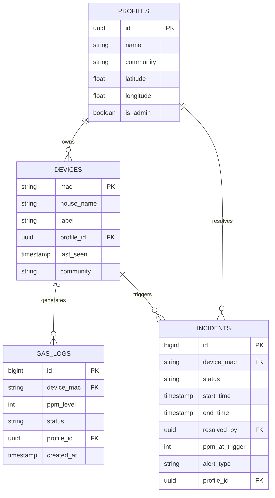

# Conceptual Model for H-Fire Monitoring System

## 1. Introduction

The H-Fire system is an integrated, Internet of Things (IoT)-based fire and gas leak monitoring solution designed for residential and community safety. The system architecture encompasses hardware sensor nodes, an MQTT message broker, a Node.js bridge, a cloud database backend, and a cross-platform mobile application. This conceptual model outlines the system's components, data flow, and interactions to provide a comprehensive foundation for thesis documentation.

## 2. System Architecture Overview

The system follows an event-driven IoT architecture to ensure real-time responsiveness and high availability. It is divided into four main layers:
1. **Perception Layer (Hardware):** Captures environmental data (gas/smoke levels and flame presence).
2. **Network/Middleware Layer:** Transmits data using the lightweight MQTT protocol.
3. **Data Management Layer (Backend):** Processes, stores, and securely manages data while providing real-time event subscriptions.
4. **Application Layer (Frontend):** Presents the processed information to users (Residents and Administrators) and handles critical alerting mechanisms.

### Architecture Diagram

## 3. Component Details

### 3.1 Perception Layer (IoT Hardware Node)
- **Microcontroller:** ESP32, selected for its built-in Wi-Fi capabilities and adequate processing power for sensor polling.
- **Sensors:**
  - **MQ2 Sensor:** Measures combustible gas and smoke concentrations. Outputs analog signals mapped to predefined thresholds (e.g., Safe Limit: 450, Danger Limit: 1500).
  - **KY-026 Flame Sensor:** Detects infrared wavelengths emitted by fire, providing a digital signal for immediate flame detection.
- **Actuators/Outputs:** Local LCD screen (I2C) for status display and a piezoelectric buzzer for immediate local audio alarms.

### 3.2 Network Layer (Middleware)
- **Protocol:** MQTT (Message Queuing Telemetry Transport), optimal for resource-constrained IoT devices due to low bandwidth consumption and publish/subscribe model.
- **Broker:** HiveMQ Cloud, acting as the central hub. Devices publish to topics such as `hfire/<house>/data` and `hfire/<house>/status`.

### 3.3 Data Management Layer (Backend)
- **Bridge Service:** A Node.js application (`hivemq-to-supabase-bridge.js`) subscribes to the MQTT broker, parsing incoming telemetry and executing database operations. It serves as a decoupling mechanism between the raw IoT stream and the persistent database.
- **Database:** Supabase (PostgreSQL), providing persistent storage with Row Level Security (RLS) to ensure data privacy.
- **Real-time Engine:** Supabase Realtime broadcasts database changes (e.g., a new gas log or an active incident) to connected mobile clients instantly via WebSockets.

### 3.4 Application Layer (Mobile App)
- **Framework:** React Native built with Expo, allowing cross-platform deployment (iOS/Android).
- **Role-Based Access:**
  - **Resident:** Limited view restricted to devices associated with their specific `profile_id`.
  - **Administrator:** Elevated privileges allowing visibility of all devices across the community.
- **Critical Features:**
  - **Force Notifications:** Admin-level foreground alerts that override normal UI flows, utilizing `expo-av` for continuous siren and `expo-haptics` for persistent vibration during an active emergency.
  - **Live Community Map:** Geospatial visualization of device statuses, with markers dynamically shifting color based on real-time incident states.

## 4. Entity-Relationship (ER) Model

The database schema is structured to map physical devices to their respective owners while maintaining an immutable log of sensor readings and discrete incident events.

## 5. Event Flow Description

The operational sequence during an emergency is modeled as follows:

1. **Detection:** The MQ2 sensor records a gas concentration exceeding the `DANGER_LIMIT` (e.g., > 1500 PPM), or the KY-026 detects a flame.
2. **Local Alert:** The ESP32 immediately activates the local buzzer and updates the LCD display to warn occupants.
3. **Transmission:** The ESP32 constructs an MQTT payload and publishes it to the HiveMQ broker over Wi-Fi.
4. **Bridging:** The Node.js bridge receives the MQTT message, identifies the device via its MAC address, and inserts a new record into the `gas_logs` table with status 'Danger'. It also generates a new record in the `incidents` table.
5. **Real-time Broadcast:** Supabase detects the database insertions and broadcasts the new records to all authenticated, subscribed mobile clients.
6. **Notification Action:**
   - The **Resident's** app receives the alert for their specific device.
   - The **Admin's** app, utilizing global listener privileges, triggers the Force Notification System (siren, vibration, full-screen modal) and updates the Live Community Map, painting the affected residence's marker red for immediate intervention.
