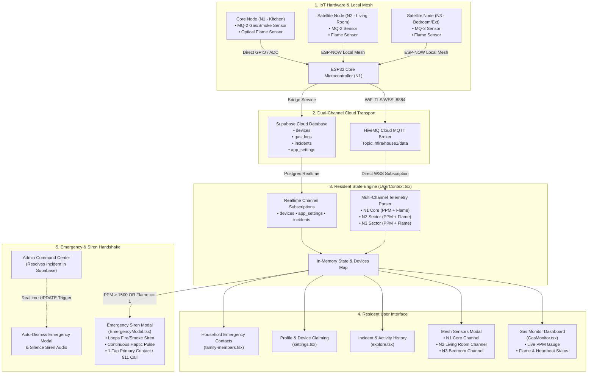

# 📱 H-Fire Resident Mobile Application — End-to-End Workflow

This document details the complete operational and technical workflow of the **H-Fire Resident Mobile Application** (`Desktop/H-FIre`), explaining how physical sensor telemetry is acquired from the IoT hardware, processed through cloud layers, displayed on the resident interface, and synchronized with the Admin Command Center.

---

## 🌐 Overall Resident System Architecture



---

## 🔍 Step-by-Step Resident Workflow

### 1. Physical Sensing & Local Mesh Transmission
1. **Sampling**: The MQ-2 Gas/Smoke Sensor and Optical Flame Sensor continuously read atmospheric gas concentrations and infrared flame presence.
2. **Local Mesh Aggregation (ESP-NOW)**:
   - Satellite nodes (**N2** and **N3**) transmit their local room readings wirelessly to the Core Node (**N1**) without requiring separate internet connections.
   - The Core Node (**N1**) compiles all sector readings into an aggregated JSON packet:
     ```json
     {
       "mac": "20:50:0D:33:68:0C",
       "N1_Gas": 135,
       "N1_Fire": 0,
       "N2_Gas": 110,
       "N2_Fire": 0,
       "N3_Gas": 95,
       "N3_Fire": 0,
       "timestamp": 1723812345
     }
     ```
3. **Transmission**: The Core Node publishes this payload to the HiveMQ Cloud MQTT broker under `hfire/house1/data` every 1000ms.

---

### 2. Live Telemetry Ingestion (Resident App)
1. **0ms MQTT Direct Stream**:
   - `UserContext.tsx` maintains a direct WebSocket MQTT connection to HiveMQ Cloud (`wss://...:8884/mqtt`).
   - Extracts **N1_Gas** & **N1_Fire** for the main household node, and updates **N2** & **N3** satellite channel states.
2. **Telemetry In-Memory Caching (`latestTelemetryMapRef`)**:
   - Live telemetry spikes are held in memory so periodic database background syncs do not cause readings to flicker or reset to zero.
3. **Threshold Assessment**:
   - **Normal (Safe / Green)**: $\le 450\text{ PPM}$ and no flame detected.
   - **Warning (Gas/Smoke Leak / Yellow)**: $451 - 1500\text{ PPM}$.
   - **Danger (Fire / Red)**: $> 1500\text{ PPM}$ or Optical Flame active.
   - **Offline (Gray)**: Inactivity $> 60\text{ seconds}$.

---

### 3. Resident Dashboard & Mesh Subsystem Inspection
1. **Primary Gauge Display (`GasMonitor.tsx`)**:
   - Shows the primary household node's real-time gas level (PPM), dynamic progress indicator, flame status badge, and last heartbeat.
   - Live network indicator badges confirm **Cloud Service** and **App Network** connectivity.
2. **Interactive Mesh Sensor Modal**:
   - Tapping the device card opens a slide-up modal revealing the entire household sensor network:
     - **Primary Core Node (N1)**: Kitchen / Core Node PPM, Flame Status, MAC address.
     - **Secondary Node 2 (N2)**: Living Room / Sector 2 live PPM, Flame state, and safety badge.
     - **Secondary Node 3 (N3)**: Bedroom / Exterior live PPM, Flame state, and safety badge.
3. **Custom Device Renaming**:
   - Residents can rename their sensor units (e.g. *"Kitchen Main Unit"*, *"Garage Sensor"*), updating Supabase `devices` table and local AsyncStorage.

---

### 4. Emergency Response & Incident Synchronization
1. **Critical Hazard Activation**:
   - If PPM $> 1500$ or Flame is detected on any node, the bridge inserts an `Active` incident into the `incidents` table and dispatches an Expo Push Notification.
   - The resident app's Supabase Realtime listener triggers `EmergencyModal.tsx`.
2. **Full-Screen Siren & Haptics**:
   - Plays continuous looping audio sirens:
     - `assets/Fire Alarm.mp3` for fire/flame events.
     - `assets/Smoke Alarm Sound.mp3` for gas leak events.
   - Looping tactile haptics alert the resident even if the device is muted.
3. **1-Tap Emergency Calling**:
   - **Primary Household Contact**: Calls the resident's designated family member with 1 tap.
   - **BFP / Emergency Hotline**: Auto-dials 911 or local Bureau of Fire Protection.
   - **Admin Hotline**: Direct speed-dial to the community HOA command center.
4. **Admin Resolution Auto-Dismissal**:
   - When the Admin resolves the emergency on the Admin platform (`incidents.status = 'Resolved'`), the resident's Realtime `UPDATE` listener intercepts the event.
   - **The Emergency Modal automatically dismisses and unloads the siren audio immediately**, without requiring manual dismissal.

---

### 5. Profile, Device Management & History
1. **Device Discovery & Claiming (`app/(tabs)/settings.tsx`)**:
   - Scans and detects active unlinked ESP32 nodes on the network.
   - Links the device to the resident's UUID, household name, and subdivision Block & Lot.
2. **Family Emergency Contacts (`app/family-members.tsx`)**:
   - Manage household members with designated primary contact roles for rapid emergency calling.
3. **Activity & Incident History (`app/(tabs)/explore.tsx`)**:
   - Date-filterable timeline of past gas logs and emergency incidents linked to the resident's profile.
